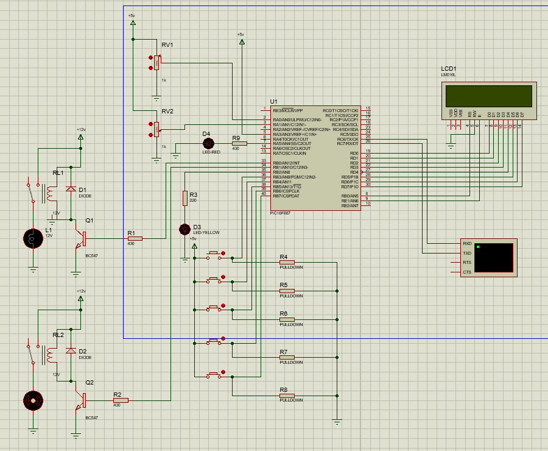
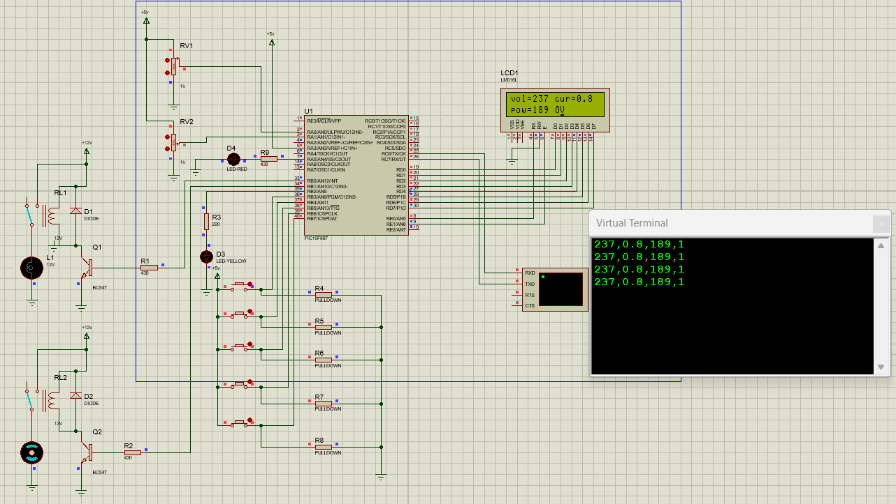

# Smart Power Distribution with Fault Protection and IoT

## Overview

This project presents an intelligent power distribution system designed using a PIC microcontroller and ESP32. The system integrates electrical protection, smart load control, and IoT-based monitoring to ensure safe and efficient power management.

## System Architecture

The system is built using two controllers:

* PIC Microcontroller (Core control and protection logic)
* ESP32 (IoT communication and cloud monitoring)

The PIC handles all real-time electrical measurements, protection mechanisms, and load control logic, while the ESP32 is used for cloud connectivity and alert systems.

## Measured Parameters

The system uses sensors to measure:

* Voltage
* Current
* Power (calculated from voltage and current)

All values are displayed on a 16x2 LCD in real time.

## Protection System

The project includes three major protection mechanisms:

### Overcurrent Protection

* If current exceeds the threshold
* The system disconnects the least priority load first

### Overvoltage Protection

* If voltage exceeds the safe limit
* All loads are turned OFF
* Fault condition is triggered

### Undervoltage Protection

* If voltage drops below threshold
* Warning is displayed on LCD
* LED indication is activated

## Load Control System

The system implements intelligent load management techniques:

* Smart Load Scheduling
* Automatic Load Shedding
* Peak Load Management

### Modes of Operation

#### Auto Mode

* Priority loads (Load 1 and Load 2) are turned ON
* System monitors current continuously
* If current is within safe limit → Load 3 is enabled
* If current exceeds limit → Load 3 is disconnected

#### Manual Mode

* User can control loads using switches
* System still ensures protection based on current limits
* Load operation depends on both user input and safety conditions

## Communication System

* UART communication is used between PIC and ESP32
* PIC sends:

  * Voltage
  * Current
  * Power
  * Fault status

ESP32 receives this data and processes it for cloud monitoring.

## IoT Integration

* ESP32 connects to WiFi and uploads data to ThingSpeak
* Real-time monitoring of electrical parameters is enabled
* Data can be accessed remotely

## Alert System

* When overvoltage fault occurs:

  * SMS alert is sent using GSM module
  * Automatic call alert is triggered
* This ensures immediate notification during critical conditions

## Display System

* 16x2 LCD is used to display:

  * Voltage
  * Current
  * Power
  * Fault status
  * Operating mode (Auto / Manual)

## Features

* Real-time voltage, current, and power monitoring
* Multi-level protection (Overcurrent, Overvoltage, Undervoltage)
* Intelligent load control and scheduling
* Dual-mode operation (Auto and Manual)
* IoT-based cloud monitoring using ESP32
* GSM-based alert system (SMS + Call)
* LCD-based real-time display

## Technologies Used

* Embedded C
* PIC Microcontroller (PIC16F887)
* ESP32
* UART Communication
* ADC (Analog to Digital Conversion)
* ThingSpeak (IoT platform)
* GSM Module

## Applications

* Smart power distribution systems
* Industrial load management
* Electrical protection systems
* Energy monitoring and control

## Conclusion

This project demonstrates a complete smart power distribution system integrating embedded control, electrical protection, and IoT technology. It improves system safety, enables efficient load management, and provides real-time monitoring and alert mechanisms, making it suitable for modern electrical and industrial applications.

## Circuit Diagram

## Output

